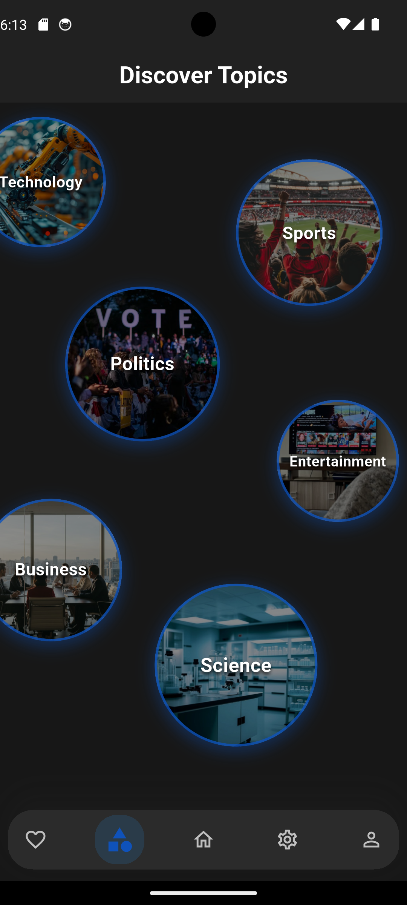
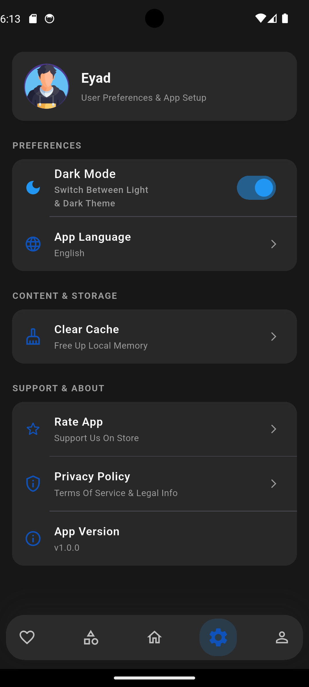
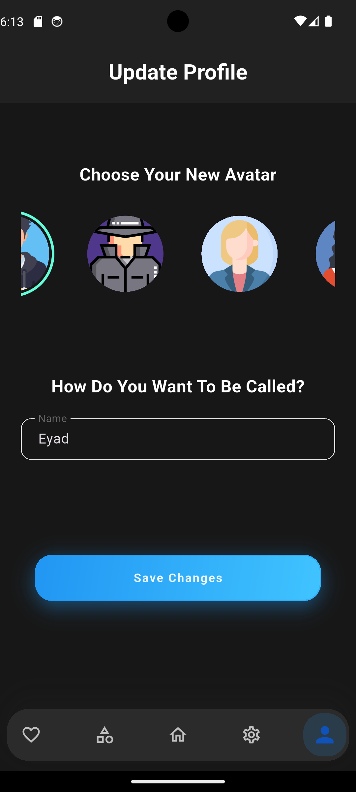

# Nus - Modern News Aggregator App

**Nus** is a sleek, modern, offline-first news aggregator mobile application built with **Flutter** and **GetX**. It delivers a high-performance experience with live REST API integration, dynamic multi-level filtering, custom glassmorphic UI components, and instant offline content accessibility.

---

## Features

- **Offline-First Architecture:** Instant app launch using `GetStorage` and disk image caching.
- **Dynamic Pagination & Networking:** Smooth infinite scroll loading using the `http` package.
- **Multi-Filter System:** Filter news simultaneously by Category, Region/Language (Arabic, US, India), and Live Text Search.
- **Custom Glassmorphic UI:** Aesthetic category bubble selector built using `LayoutBuilder` & `ClipRect` with dark mode and royal blue (`#0F52BA`) accents.
- **Full Localization & RTL Support:** Seamless switching between English and Arabic with immediate layout directionality adjustments on startup.
- **Utility Features:** Storage/cache management, external article reader via `url_launcher`, and rate-limit safety throttling loops.

---

## Tech Stack & Dependencies

- **Framework:** Flutter (Dart)
- **State Management:** GetX
- **Networking:** HTTP (`http`)
- **API:** NewsData.io
- **Local Storage:** GetStorage
- **Utilities:** `path_provider`, `url_launcher`

---

## Screenshots & Showcase

<p align="center">
  
  
  
  
  
  
  
  
</p>

---

## ⚙️ Getting Started

1. **Clone the repository:**
   ```bash
   git clone [https://github.com/eyad-flutter/Nus_App.git](https://github.com/eyad-flutter/Nus_App.git)
